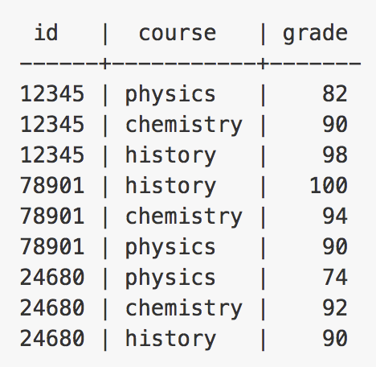

## Swift Kuery Demo

This is the code repo for the Kuery demo I performed on stage at ForwardSwift in SF on March 2, 2017.

## How-to

You must have PostgreSQL running on your local machine, and you need to have it available on port 5432. You also must run `swift build` in the root directory of this repo to pull down the requisite dependencies.

The database you access and the username are variable in the Kuery Demo.

The table that you should have loaded into your db looks like so:

For more info and examples of queries you can run, check out the repo for Kuery [here](https://github.com/IBM-Swift/Swift-Kuery).